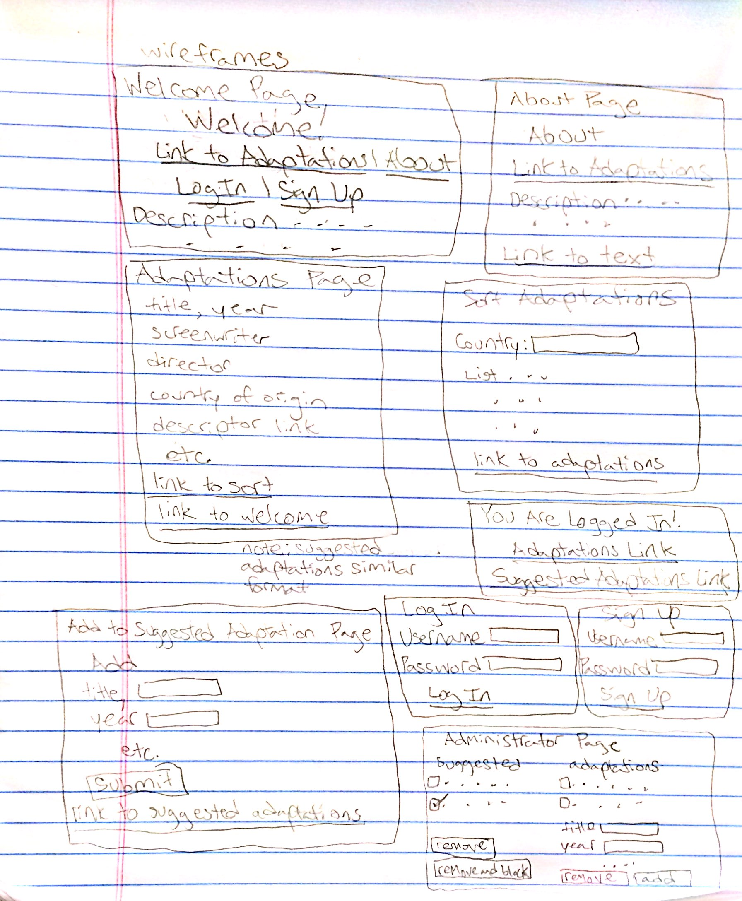
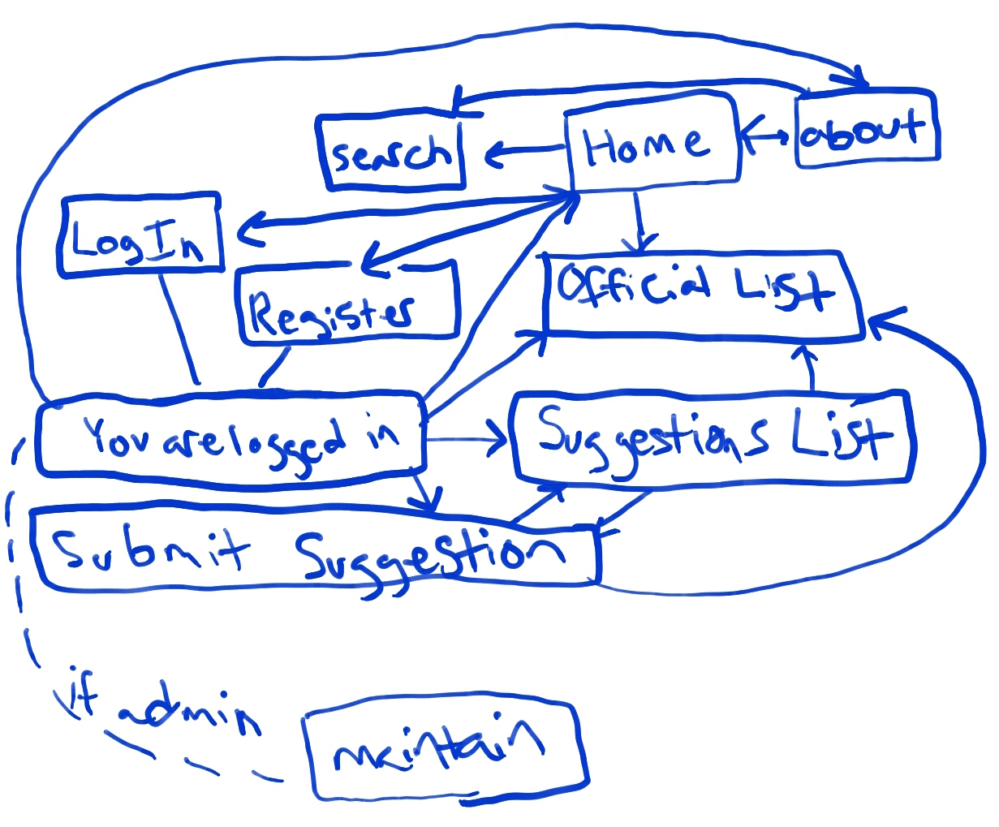

# The Little Mermaid

## Overview

The Little Mermaid is a very popular fairy tale, thanks to the combined fame of Hans Christian Andersen and Disney.  There have been many adaptations.  However none but the 1989 Disney version are known on a wide scale.  In fact, there does not exist a website that keeps a simple list of the adaptations that have been put out there.  And as I have been continuing to find more, I'm also open to outside suggestions.  

That is why I wish to create a user-based website.  It will have one page which is maintained only by the administrator, me, which is viewable to the public.  This has a list of all known Little Mermaid adaptations - information like the title, director, country of origin, along with a link to a more descriptive site about that adaptation.  Then I would like a seperate list available only to users in which they can add a suggested adaptation for me to then look at to consider to add to the public official adaptation list.


## Data Model

(Describe the documents that you'll be storing - assuming that you're using a document based NoSQL database, like mongoose ... this can be in the form of commented plain JavaScript objects or an _actual_ Mongoose schema)

Minimally, we'll have to store Users, Lists and Items

* users can have multiple lists
* each list can have multiple items

First draft schema:

```javascript
// users
// * our site requires authentication...
// * so users have a username and password
// * ideally they could also upload images to also be considered
var User = new mongoose.Schema({
  // username, password provided by plugin
});

// the official list of adaptations
// * includes the information about each adaptation
// * ideally I could have the link section be a list of links (how would this be done?)
var OfficialList = new mongoose.Schema({
  name: {type: String, required: true},
  screenWriter: {type: String, required: true},
  director: {type: String, required: true},
  country: {type: String, required: true},
  year: {type: Number, required: true},
  link: {type: String, required: true},
	
});

// a suggestions list
// * each suggested adaptation must have a related user
// * every suggestion has a date submitted so I the administrator can view them in order submitted
// * ideally I could have the link section be a list of links (how would this be done?)
var SuggestedList = new mongoose.Schema({
  user: {type: mongoose.Schema.Types.ObjectId, ref:'User'},
  dateSubmitted: {type: Date, required: true},
  name: {type: String, required: true},
  screenWriter: {type: String, required: true},
  director: {type: String, required: true},
  country: {type: String, required: true},
  year: {type: Number, required: true},
  link: {type: String, required: true},
	
});
```

## Wireframes



## User Stories

* as a visitor, I want to view the adaptations list so I know what to watch
* as a registered user, I want to add an adaptation to the suggested list for consideration
* as a visitor, I want to register so I can add adaptations to the suggested list for consideration
* as a visitor, I want to sort the ist of adaptations by country of origin
* as the administrator, I want to remove suggestions from the suggestions list and maybe add them to the official list

## Site Map



